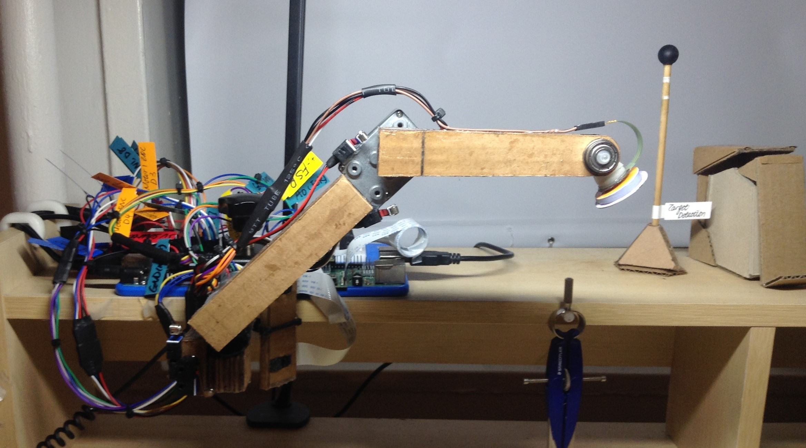
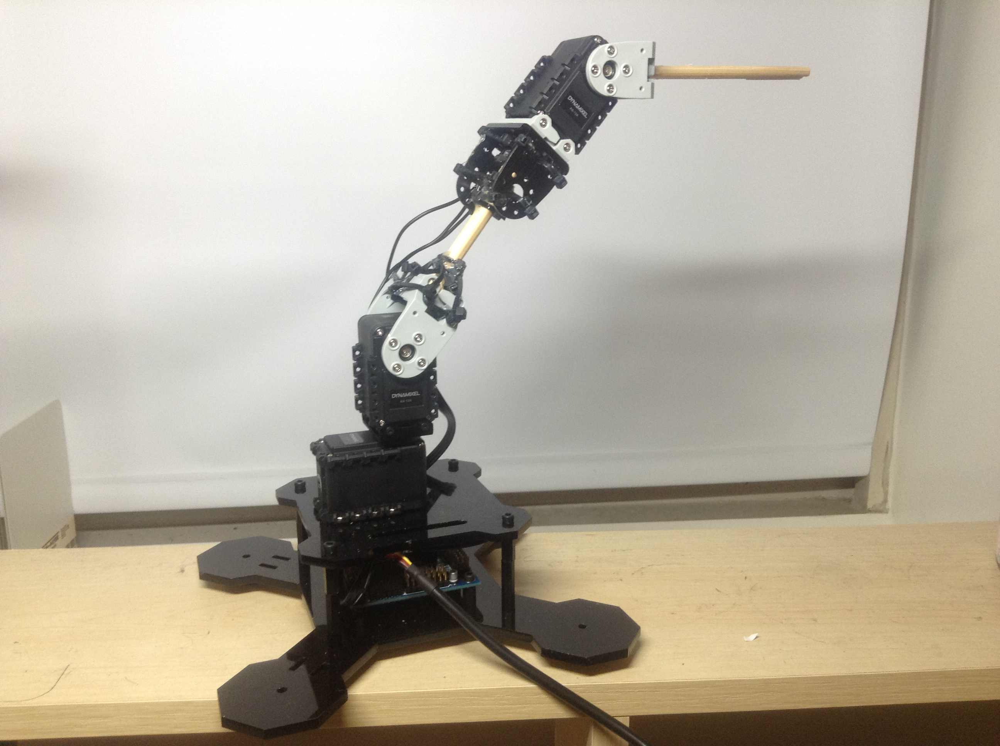
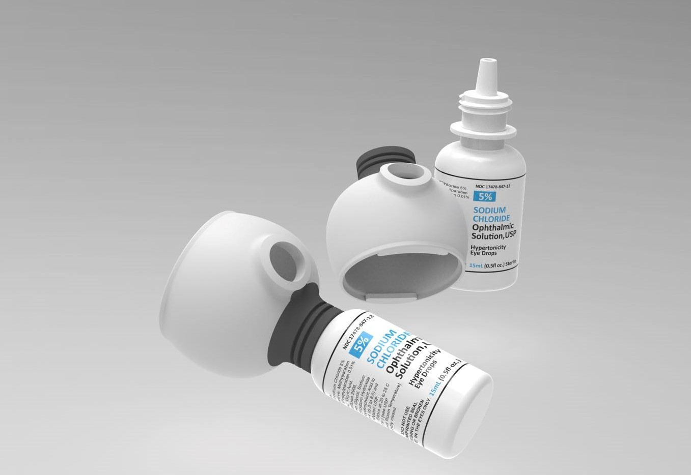
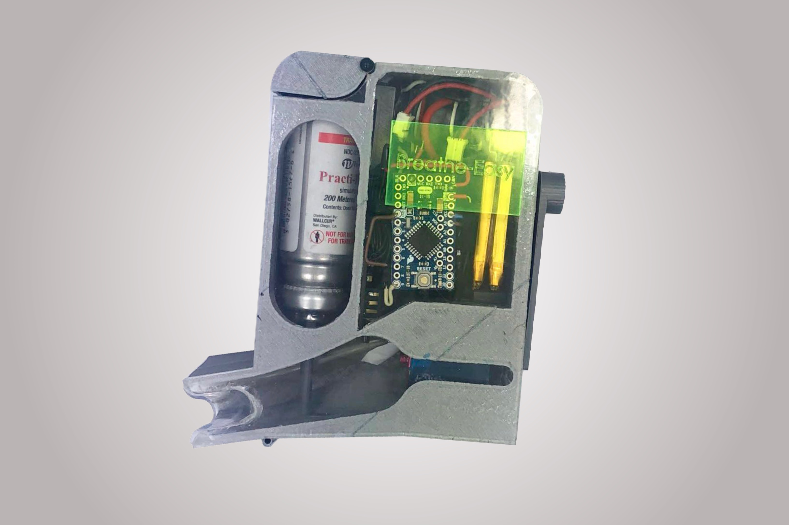

# ROBOTICS

## [Centralized Robotic Arm Hybrid Position Force Control](https://github.com/SamoaChen/2-Linkages-Robotic-Arm-Hybrid-Position-Force-Control)              
### *April-July 2020*

* Designed and built a 2 linkages robotic arm out of cardboard during quarantine, and achieve centralized position control, hybrid position force control, and achieved object tracing with stereo vision
* Designed and constructed an angle overshoot-proofing mechanism for two DC motors
* Derived EOM and jacobian matrix, simulated centralized controller in MATLAB, and converted to NumPy version
* Integrated modules Arduino, Raspberry pi, DC motors with encoder, Motor Driver, FSR sensor, Potentiometer, Lever Switch
* Implemented the controller through serial communication between Raspberry pi and Arduino Uno
* Calibrated and built a stereo camera and coded an object 3D coordinate measuring program
* Integrated the stereo camera with robot arm controller and achieved object tracing with the robotic arm end-effector

## [Stereo Vision Based Robotic Manipulator](https://github.com/SamoaChen/2-Linkages-Robotic-Arm-Hybrid-Position-Force-Control)      
### *Sep 2020-present*

* Simulated numerical inverse kinematics and inverse velocity path control of a 3 linkages robotic manipulator in MATLAB
* Constructed a robotic manipulator and implemented inverse velocity path control

# PRODUCT DESIGNING

## [Push Eject Power Strip](https://github.com/SamoaChen/2-Linkages-Robotic-Arm-Hybrid-Position-Force-Control)                 
### *2017*

* Designed power strip that will release outlet with one push
* Conducted market research and investigated existing products
* 3D printed model, and adjusted model according to tests

## [Eye Drop Assister](https://github.com/SamoaChen/2-Linkages-Robotic-Arm-Hybrid-Position-Force-Control)                 
### *2018*

* Designed eye drop assistor that optimize user experience and guide drops to eyeballs better
* 3D printed model, and adjusted model according to tests

## [Breathe-Easy Asthma Inhaler](https://gurubbedy.wixsite.com/zhiyang/project-1)                 
### *June-Aug 2018*

* Designed, prototyped, and presented an invention: Breathe-Easy Inhaler with a partner
* The invention is an asthma inhaler that actively controls inhalation airflow for patients to optimize drug deposition
* Integrated modules Arduino, ESC controlled ducted fan, pressure sensor/servo motor, battery
*	Wrote and filed a provisional patent application, and currently working improve the design

