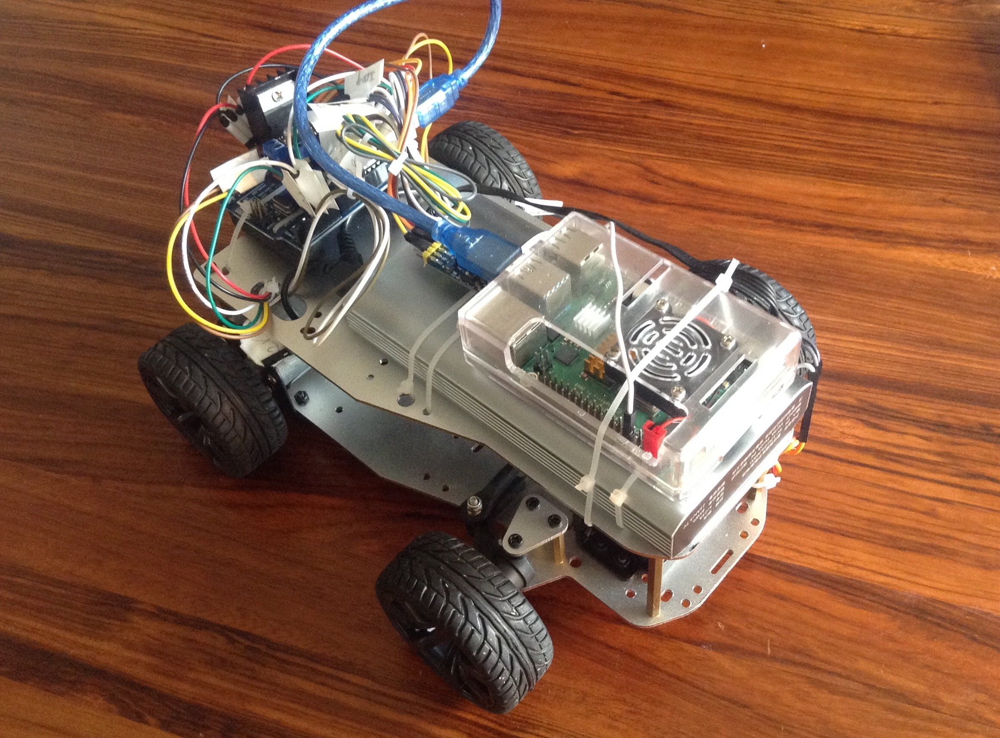
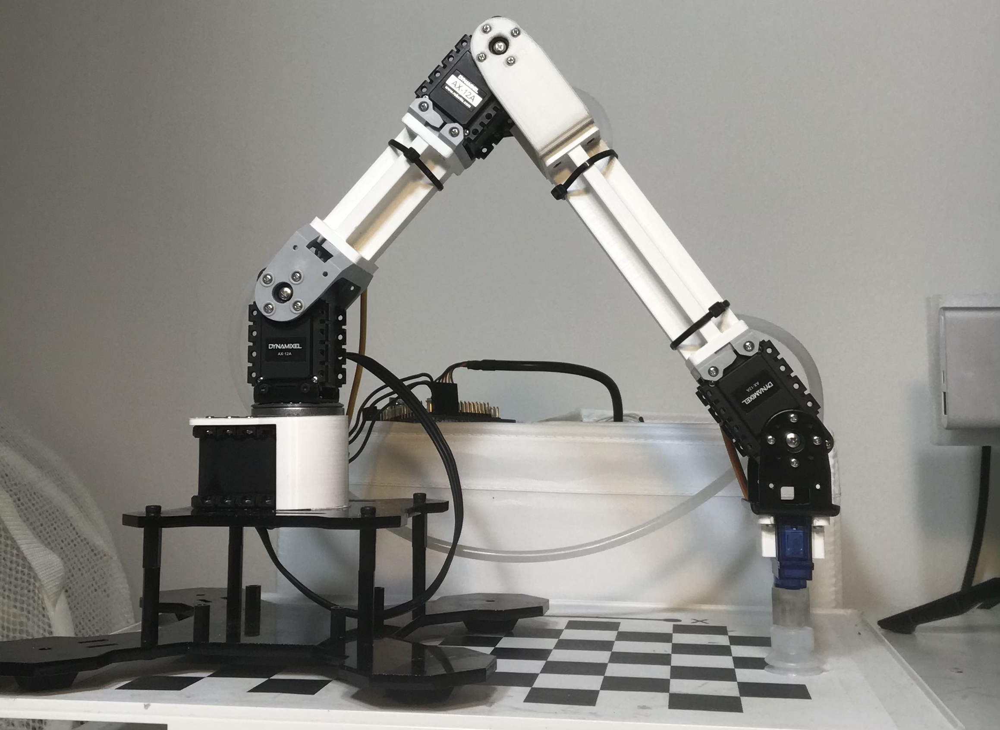

# ROBOTICS

## [Autonomous Car Light Painting (hyperlinked)](https://github.com/SamoaChen/Autonomous-Car-Trajectory-Tracking)
### *June-August 2021*

* Built a model Car and implemented trajectory tracking with course angle as the only input
* Integrated Extended Kalman Filter and gain scheduling into the trajectory tracking control loop
* Integrated modules Arduino, Raspberry pi, DC motors with encoder, Motor Driver, IMU, Servo Motor
* Designed and implemented wheel speed controller with feedforward and feedback components
* Realized the project with ROS
* Designed and took long exposure photo of trajectories

## [Centralized Robotic Arm Hybrid Position Force Control (hyperlinked) ](https://github.com/SamoaChen/2-Linkages-Robotic-Arm-Hybrid-Position-Force-Control) 
### *April-July 2020*

* Designed and built a 2 linkages robotic arm out of cardboard during quarantine, and achieve centralized position control, hybrid position force control, and achieved object tracing with stereo vision
* Designed and constructed an angle overshoot-proofing mechanism for two DC motors
* Derived EOM and jacobian matrix, simulated centralized controller in MATLAB, and converted to NumPy version
* Integrated modules Arduino, Raspberry pi, DC motors with encoder, Motor Driver, FSR sensor, Potentiometer, Lever Switch
* Implemented the controller through serial communication between Raspberry pi and Arduino Uno
* Calibrated and built a stereo camera and coded an object 3D coordinate measuring program
* Integrated the stereo camera with robot arm controller and achieved object tracing with the robotic arm end-effector

## [Stereo Vision Based Robotic Manipulator (hyperlinked)](https://github.com/SamoaChen/Stereo-Vision-Based-Robotic-Manipulator/blob/main/README.md)      
### *Sep 2020-present*

* Simulated numerical inverse kinematics and inverse velocity path control of a 3 linkages robotic manipulator in MATLAB
* Constructed a 3 DOF robotic manipulator and implemented inverse velocity path control
* Constructed a 5 DOF robotic manipulator with suction cup
* Designed and constructed a cheap version 5 DOF robotic manipulator with adhesive-picking mechanism

# CLASS PROJECT

## [SLAM with Particle Filter](https://samoachen.github.io/ZHIYANG-CHEN/)
### *March 2022*

   
   

## [Policy Iteration](https://samoachen.github.io/ZHIYANG-CHEN/)
### *March 2022*

# PRODUCT DESIGNING

## [Push Eject Power Strip (hyperlinked)](https://gurubbedy.wixsite.com/zhiyang/project-2) 
### Patent NO: CN208589597U
link:[https://patents.google.com/patent/CN208589597U/en?oq=CN208589597U](https://patents.google.com/patent/CN208589597U/en?oq=CN208589597U)
<!--- https://gurubbedy.wixsite.com/zhiyang/project-2 -->
### *2017*

* Designed power strip that will release outlet with one push
* Conducted market research and investigated existing products
* 3D printed model, and adjusted model according to tests

## [Eye Drop Assister (hyperlinked)](https://gurubbedy.wixsite.com/zhiyang/project-3)   
### Patent Pending
<!--- https://gurubbedy.wixsite.com/zhiyang/project-3 -->
### *2018*

* Designed eye drop assistor that optimize user experience and guide drops to eyeballs better
* 3D printed model, and adjusted model according to tests

## [Breathe-Easy Asthma Inhaler (hyperlinked)](https://gurubbedy.wixsite.com/zhiyang/project-1)     
### Patent Pending
### *June-Aug 2018*

* Designed, prototyped, and presented an invention: Breathe-Easy Inhaler with a partner
* The invention is an asthma inhaler that actively controls inhalation airflow for patients to optimize drug deposition
* Integrated modules Arduino, ESC controlled ducted fan, pressure sensor/servo motor, battery
*	Wrote and filed a provisional patent application, and currently working improve the design

## [Quick Link to My Complete Employment History (hyperlinked)](https://gurubbedy.wixsite.com/zhiyang/employment)
